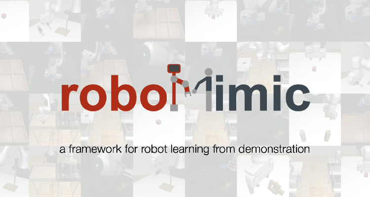
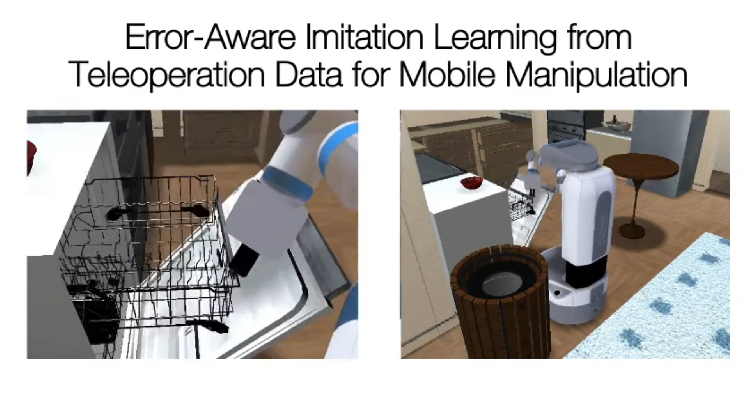
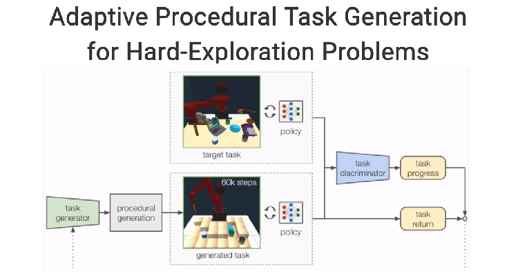
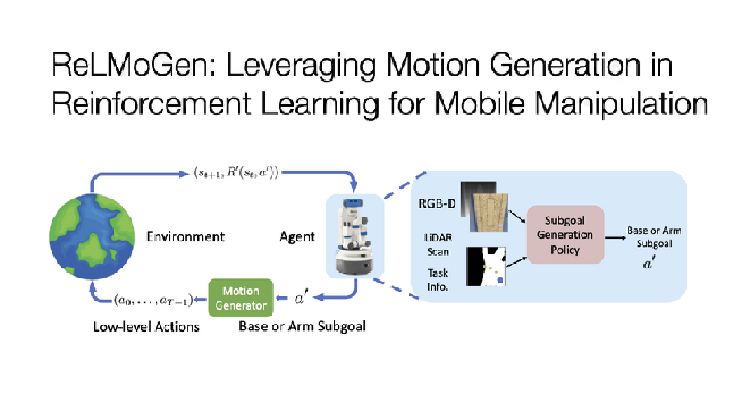
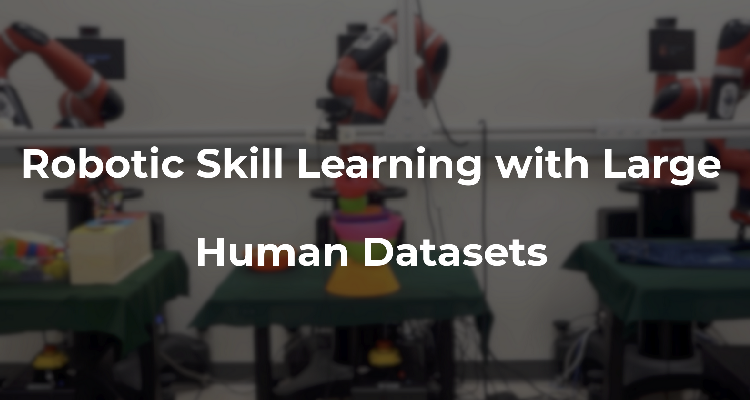
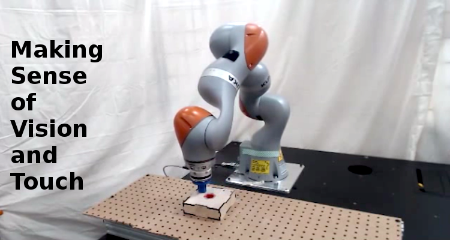
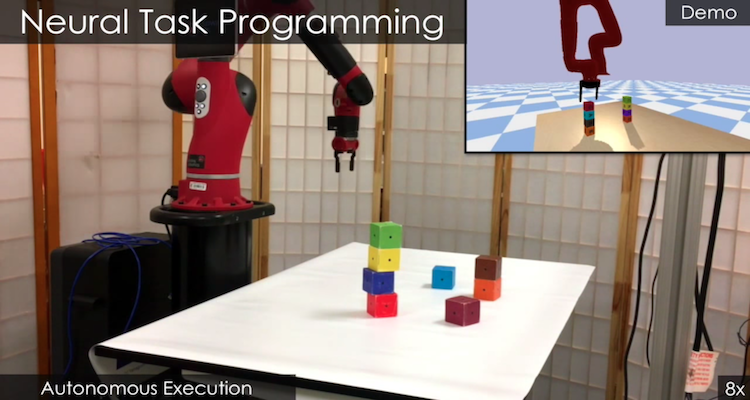

  <!-- Page Content -->
  

    

      

        <h2 class="page-header-dark">About</h2>
        

            Stanford People, AI & Robots Group (PAIR) is a research group under the <a href="http://svl.stanford.edu">Stanford Vision & Learning Lab</a> that focuses on developing methods and mechanisms for generalizable robot perception and control.
        

        

            We work on challenging open problems at the intersection of computer vision, machine learning, and robotics. We develop algorithms and systems that unify in reinforcement learning, control theoretic modeling, and 2D/3D visual scene understanding to teach robots to perceive and to interact with the physical world.
        

        
<b>
            We are always looking out for talented members to join our group. Please see our current openings at the <a href="{{ site.url }}/join">Join Us</a> page.
        </b>

      

      

          
      

    

  

 <!--
  

    Portfolio Section 
    

        

            <h2 class="page-header">News</h2>
            <ul class="news-list">
              <li>Two papers from PAIR, <a href="https://arxiv.org/abs/1909.04121">"AC-Teach: A Bayesian Actor-Critic Method for Policy Learning with an Ensemble of Suboptimal Teachers"</a> and <a href="https://arxiv.org/abs/1910.13395">"Dynamics Learning with Cascaded Variational Inference for Multi-Step Manipulation"</a>, are accepted at <a href="http://www.robot-learning.org/">CoRL 2019</a>.</li>
              <li>Three papers from PAIR, <a href="https://arxiv.org/abs/1906.08880">"Variable Impedance in End-Effector Space: An Action Space for Reinforcement Learning of Contact-Rich Tasks"</a>, <a href="https://arxiv.org/abs/1908.06769">"Continuous Relaxation of Symbolic Planner for One-Shot Imitation Learning"</a> and <a href="https://arxiv.org/abs/1911.04052">"Scaling Robot Supervision to Hundreds of Hours with RoboTurk: Robotic Manipulation Dataset through Human Reasoning and Dexterity"</a>, are accepted at <a href="http://www.robot-learning.org/">IROS 2019</a>.</li>
              <li>Our <a href="https://sites.google.com/view/visionandtouch">ICRA paper</a> on learning multimodal representations for robot manipulation won the Best Paper award.</li>
              
              <li>We released <a href="https://sites.google.com/view/densefusion">our new paper</a> on 6D pose estimation from RGB-D data.</li>
              <li>Two papers from PAIR are accepted at <a href="http://www.robot-learning.org/">CoRL 2018</a>.</li>
              <li>We have released <a href="publications">our new paper</a> on one-shot visual imitation with neural task graphs.</li>
            </ul>
        

    

  
-->

  

    <!-- Portfolio Section -->
    

        

            <h2 class="page-header">Project Highlights</h2>
        

        

            
        

        

            
        

        

            
        

        

            
        

        

            
        

        

            
        

        

            
        

        
        

            
        

        

            
        

    

    <!-- /.row -->

    

  

<!-- /.container -->

